要将我们的项目手动部署到云端，需要一系列人工操作，不仅仅是手动构建，测试，打包等，还需要将每次更新后重新打包的镜像手动上传到GCP Container Registry中，并在VM中重新拉取运行。

人工部署不仅操作繁琐，还很容易出错，通过使用GitHub Actions，我们只需要每次提交代码后，确保工作流（workflow）运行成功，就自动实现了整个部署过程。

# 什么是GitHub Actions

---

GitHub Actions 是GitHub在2018年推出的一个持续集成和持续交付的平台， 使用GitHub Actions，我们可以在每次提交代码后，通过创建的自定义工作流实现自动化构建，测试，打包上传镜像以及部署。

目前常用的CI/CD工具主要有：

- **GitHub Actions**
- **Jenkins**
- **ravis CI**
- **Circle CI**
- **GOCD……**

Actions可以简单的被理解为是一系列的自动化部署脚本，GitHub Actions [官方市场](https://github.com/marketplace?type=actions)中有一系列已经发布的Actions供我们使用，通过将不同的Action进行组合，我们可以自定义符合我们项目本身需求的工作流。

想要启动GitHub Actions服务，只需要在项目根目录下创建.github/workflows文件夹，并将你的工作流配置文件（YAML）放在该目录下，GitHub就可以自动识别，并运行该工作流，具体的工作流书写语法可以在GitHub Actions提供的[官方文档](https://docs.github.com/en/actions/using-workflows/workflow-syntax-for-github-actions#example-including-paths)中进行学习。

# 项目部署逻辑

---

通过工作流YAML文件配置，使GitHub Actions在`push` 代码到 `main` 或指定 `branch`时触发并运行整个工作流，具体流程包括:

- 自动构建并通过所有测试，打包生成最新版镜像
- 将镜像自动上传到GCP Container Registry
- 虚拟机自动删除旧镜像并从gcr拉取运行最新版本镜像

# Google Cloud Platform 配置

---

为了让GitHub Ations顺利将打包好的镜像上传到GCR，需要以下一些步骤使GitHub Actions通过 GCP登陆校验

## 启用API

创建好相应的GCP项目后，使用左侧导航栏，或在顶部搜索框搜索Container Registry和Compute Engine，并启用APIs


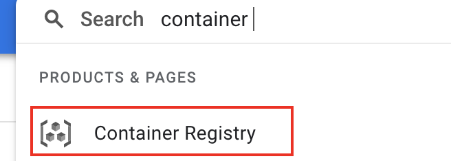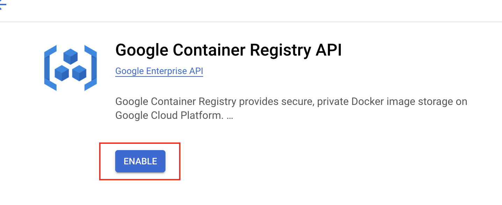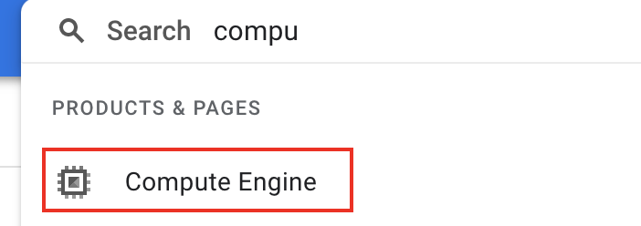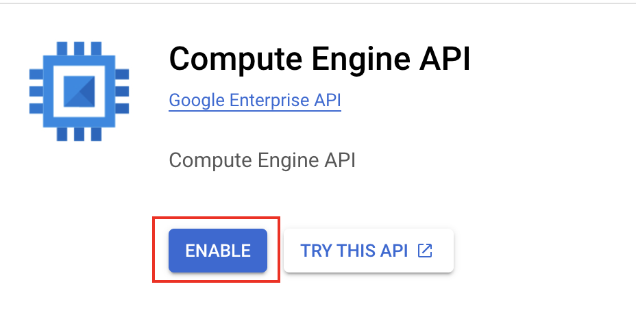

## 创建虚拟机

通过左侧导航栏，Compute Engine → VM instance, 点击Create Instance, 创建虚拟机，并按照项目需求进行配置，具体步骤参考GCP[官方文档](https://cloud.google.com/compute/docs/instances/create-start-instance)，如果有需要，可以额外配置[Load Balancing](https://cloud.google.com/load-balancing/docs/https)和[Firewall Rule](https://cloud.google.com/vpc/docs/firewalls)


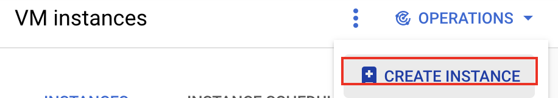

## 创建Service Account

在顶部搜索栏搜索service account，进入对应界面后，点击顶部“CREATE SERVICE ACCOUNT”创建一个service account。


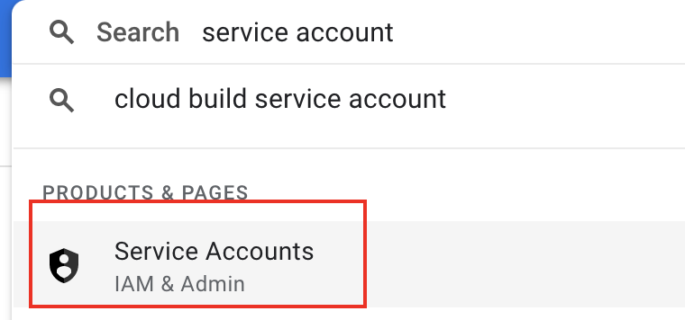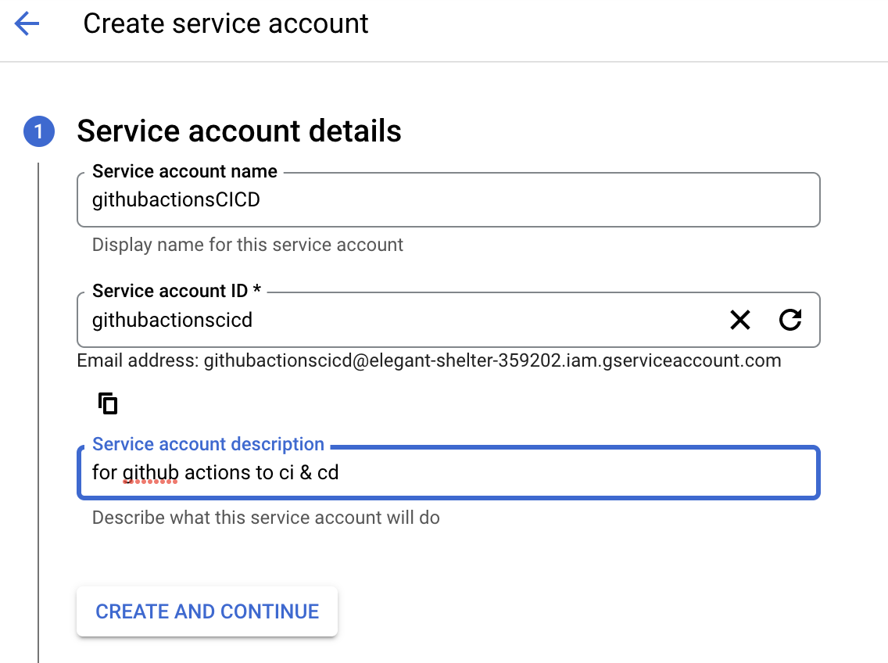


左侧导航栏通过 IAM & Admin -> IAM，查看service account的role&permission。

GCP通过将不同permission赋给不同role来进行分类，project owner通过给service account 赋予不同的role， 使该account拥有访问对应资源的权限，同时也防止该account访问GCP未被授权的资源。同一权限可能同时被赋予给了不同role，因此在为service account分配role去访问对应资源时，应避免给该account分配一个具有过多permission的role，具体role&permission list 可以在[官方文档](https://cloud.google.com/iam/docs/understanding-roles#predefined_roles)中查看

我们创建的service account需要权限去管理虚拟机，上传镜像到 gcr，可以为该account分配Compute Instance Admin和Storage Admin role。


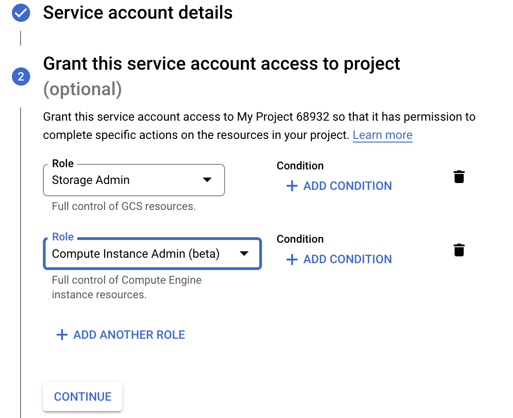

## 生成service account key file

service account创建完成后，我们需要为这个account生成对应的service account key，并将它配置为一个GitHub secret。

进入service account 页面，选择我们刚刚创建的service account，选择KEYS，再点击ADD KEY → Create new key


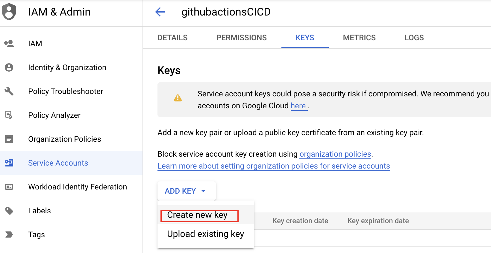

选择JSON格式后，点击CREATE。

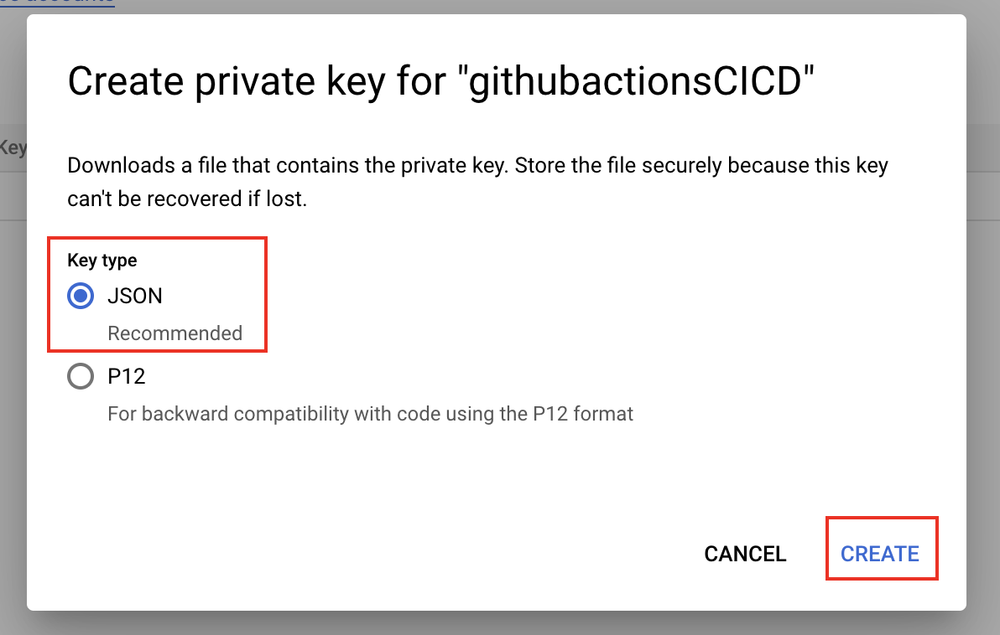

完成后，该JSON file会自动下载到本地，注意，一个key对应的JSON file只可以下载一次，90天后会自动过期。

# 将下载的service account key 添加到repository’s secret中

---

在准备添加GitHub Actions的repo中，点击Settings → Secrets → “New repository secret”

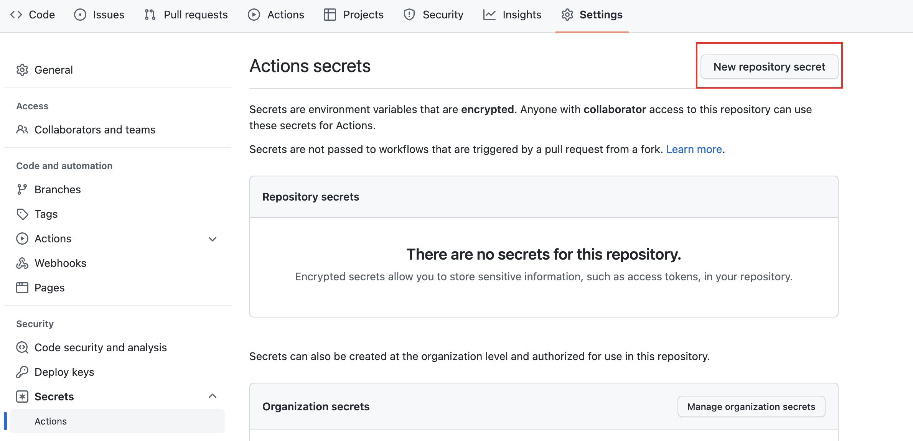

将JSON file中的内容复制到value中，并将该secret命名为GCE_AUTH_KEY

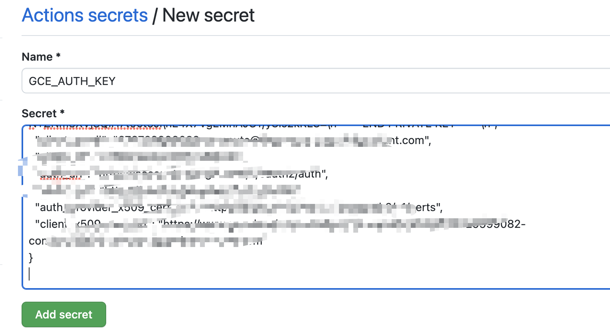

# 编写完整的workflow YAML文件

---

```yaml
name: Example CI&CD with Gradle to GCP  # 自定义你的工作流的名称

on:
  push:
    branches: [ "main" ] # 指定push触发部署的branch
  pull_request:
    branches: [ "main" ] # 指定pull_request触发部署的branch

jobs:
  build:

    runs-on: ubuntu-latest  # 使用ubuntu系统镜像运行自动化脚本

    steps: # 设置自动化脚本运行顺序
      - uses: actions/checkout@v3    # 下载代码仓库

      - name: Set up JDK 17          # 设置JDK环境
        uses: actions/setup-java@v3
        with:
          java-version: '17'
          distribution: 'temurin'

      - name: Setup Gradle           # 设置gradle环境
        uses: gradle/gradle-build-action@v2

      - name: Run gradlew command    # 设置执行构建，测试命令
        run: |
          chmod +x gradlew
          ./gradlew build

      - id: commit                   # 为打包的image添加tag
        uses: pr-mpt/actions-commit-hash@v1
        with:
          prefix: "sha-"

      - uses: RafikFarhad/push-to-gcr-github-action@v4.1 # 将image上传到gcr
        with:
          gcloud_service_key: ${{ secrets.GCE_AUTH_KEY }} # 指定设置的gcp secret key
          registry: gcr.io
          project_id: # 你的gcp project id
          image_name: # 你的image名字
          image_tag: ${{ steps.commit.outputs.short }},latest # 设置image tag

      - id: auth # 通过gcp身份校验
        uses: google-github-actions/auth@v0
        with:
         credentials_json: ${{ secrets.GCE_AUTH_KEY }}
         service_account: # your service account address

      - name: Set up Cloud SDK # 安装gcloud
        uses: google-github-actions/setup-gcloud@v0

      - name: Deploy Image to GCP VM # 通过在GitHub Actions中执行gcloud command 实现重启虚拟机
        run: |-
            gcloud compute instances stop your_instance_name  --zone=your_zone
            gcloud compute instances start your_instance_name  --zone=your_zone
```


# 在虚拟机中设置metadata

---

从gcp左侧导航栏中进入 VM instance，选择你的虚拟机，添加custom metadata。在script中，设置image删除，拉取，composeup等相关命令。


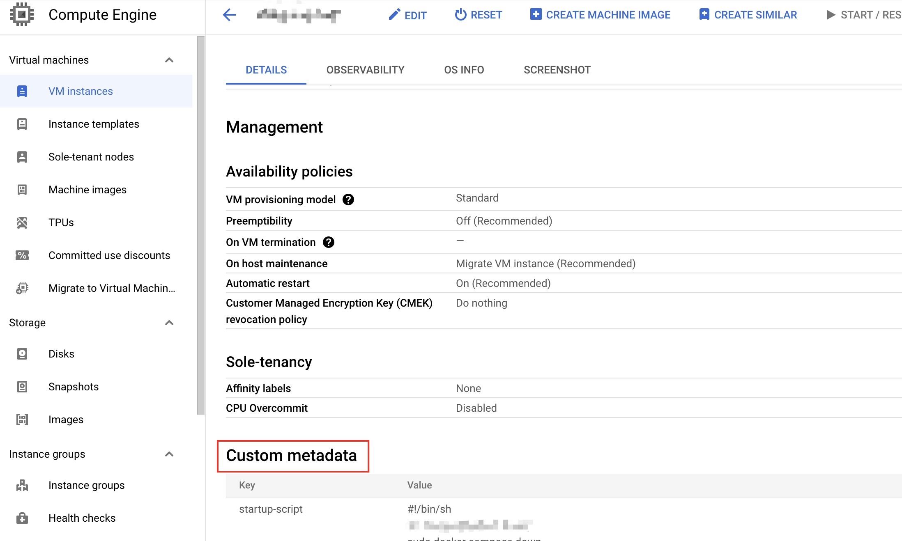
# 测试workflow运行状态

---

将代码提交后，GitHub Actions会被触发，几分钟后，可以在Actions标签中查看工作流运行状态。


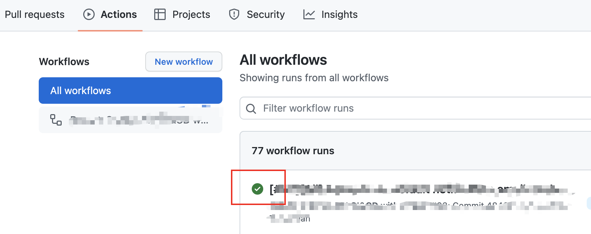

在gcr中，可以看到打包的镜像已经被上传到gcr中。

