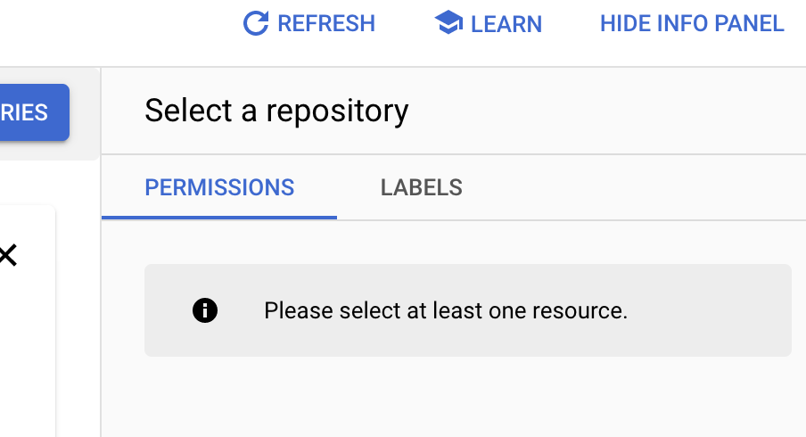

# 打包镜像

---

- 使用环境变量将配置文件中的变量抽出

```docker
// 在Dockerfile中使用REACT_APP_的前缀配置环境变量

ENV REACT_APP_USERNAME=$REACT_APP_USERNAME
ENV REACT_APP_PASSWORD=$REACT_APP_PASSWORD
```

```jsx
// 在js中获取传入的环境变量

const username = process.env.REACT_APP_USERNAME
const password = process.env.REACT_APP_PASSWORD
```

 

- 打包镜像

```jsx
docker build . -t <image_name>
```

- 配置env-file

```jsx
// env-file
REACT_APP_USERNAME=username
REACT_APP_PASSWORD=password
```

- 指定env-file 并启动容器

```jsx
docker run -p PORT:PORT --env-file <dir/name_of_envfile> <image_name>
```

ps： 在本地启动react，可配置 .env文件，启动程序即可

更多关于在react中配置环境变量可参考[https://create-react-app.dev/docs/adding-custom-environment-variables/](https://create-react-app.dev/docs/adding-custom-environment-variables/)

```jsx
// .env
REACT_APP_USERNAME=username
REACT_APP_PASSWORD=password
```

⚠️  传入的环境变量如果是一个Json array, 如[123,456]，在读取时会被识别为“[123,456]”可使用 json.parse()将其读成array

```jsx
// env-file
REACT_APP_LIST=[{"id": 1,"age": 25},{"id": 2,"age": 27}]

// js
const list = JSON.parse(process.env.REACT_APP_LIST)
```

# 上传到gar

---

## Gar VS Gcr

Google Artifact Registry: 是在Google Container Registry(gcr)上的延展升级版, 后续的新功能将只会在gar上提供，gcr只做关键的维护。

gar既可以管理container artifacts也可以管理非container artifacts。

更多的信息： [https://cloud.google.com/blog/products/application-development/understanding-artifact-registry-vs-container-registry](https://cloud.google.com/blog/products/application-development/understanding-artifact-registry-vs-container-registry)

## 在gcp的gar中创建repository

通过Github Action 自动上传镜像至gar

在.github/workflows中添加该flow的yaml 文件

```yaml
name: to GCP

on: //触发action的事件
  push:
    branches: [ "main" ]
  pull_request:
    branches: [ "main" ]

jobs:
  CD:
    runs-on: ubuntu-latest

    steps:
      - uses: actions/checkout@v3 

      - id: commit
        uses: pr-mpt/actions-commit-hash@v1
        with:
           prefix: "sha-"

      - uses: par-tec/docker-push-gar-image@v0.0.3
        with:
          image_name: image_name
          image_tag: ${{ steps.commit.outputs.short }}
          gar_hostname: <gar_hostname>
          gar_project: <gar_project>
          gar_service_account: ${{ secrets.GCLOUD_SERVICE_KEY }} //github secret里面存储到gcp ssh key
          tag_latest_version: true
```

## 向其他人公开你的gar

---

选中你的repo, 在右侧的INFO PANEL中修改权限，即可向特定权限的人公开你的repo。
